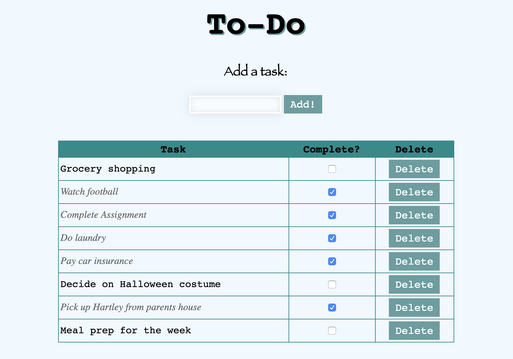

# Weekend To-Do List

## Description
*Duration: Weekend Project*

The user interface includes an input field to add a task. Once added, the task will be listed in the table below, and stored in the database. Each task in the table has a "delete" option as well as a check box for once the task is completed. If the completed box is checked, the text style of that task changes. These changes and deletions are also reflected in the database.

## Screen Shot

## Built With
- Visual Studio Code
- jQuery Version 3.4.1
- Node Version 12.11.1
- Postgres/Postico

## Acknowledgement
Thanks to Prime Digital Academy in Minneapolis who equipped and helped me to make this application a reality.

## Support
If you have suggestions or issues, please email me at hayleyhollermann.com